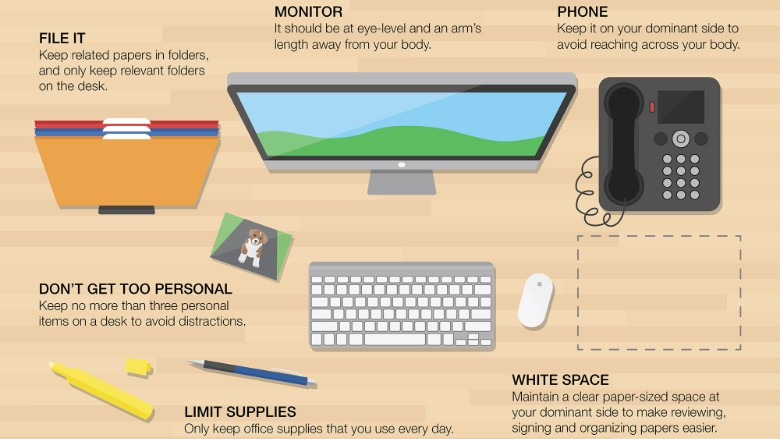
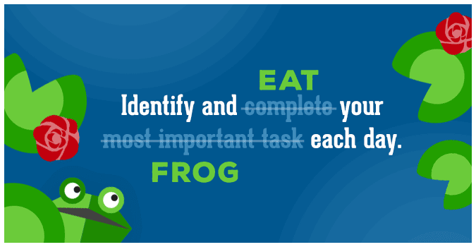
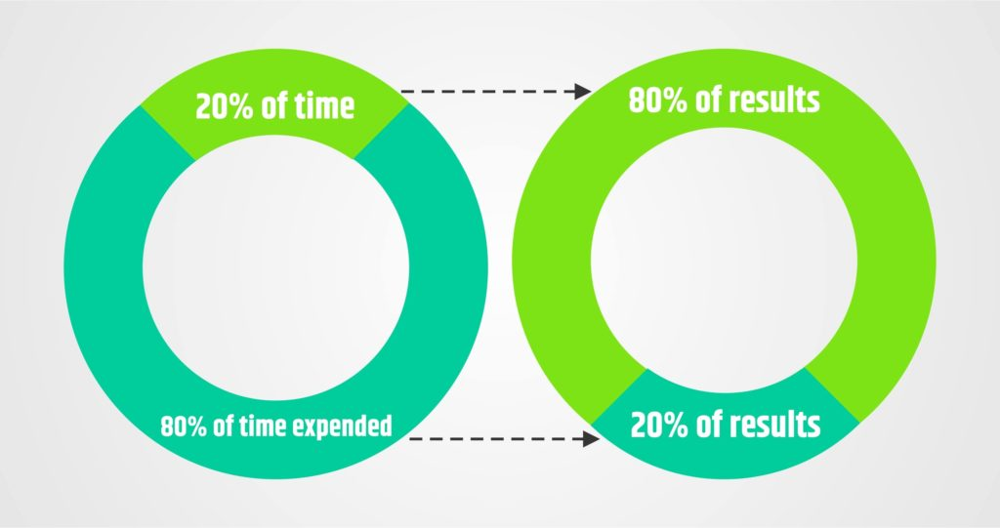

You must have been through those days when we are stuck inside a lazy rut and are unable to get out. Well, you are not alone, we all pass through that time when those 24 hrs look so little in front of the work you have. The biggest question for everyone's **how to get things done without procrastinating** on the thoughts of completing things and not actually doing them.
But at the end of the day, we all need to know that 24 hrs are more than sufficient to progress towards a goal. All we need to know is that The only thing you can control is how you manage this time for maximum efficiency and minimal stress.
> I have researched and found some steps you can follow with some bonus tips to get your things and done on time.

## Step 1. Set the table and think on paper
***
Getting things done is the hardest when you don’t know what are the things you need to complete. It means that you need to organize tasks you need to do, what are their due dates and prioritize them in a suitable order.
It’s easily the best and a well-accepted method to organize your task is a well-managed to-do list. It may sound cliche but it is the most important thing to do first in the morning. Not only once, but you can have multiple to-do lists.

The second thing is to arrange all those tasks priority wise. To waste your time on doing things which are not important at the moment and could be done later must be the last thing you want to do.
Think about your goals and review them daily. Every morning when you begin, write the most important tasks you want to execute.
One pro tip for making to-do lists is to add enough detail to have clarity of what you need to do. However, do not over-complicate them by adding too much information. A hefty to-do list can be intimidating and demotivating.

## Step 2. Get in the right mood to work
***
Do you remember the days when you were right in the mood, felt sufficiently passionate and crushed everything you decided? Well, It wasn’t some miracle, You can do that again. You know how did that happen?

It’s all about your mind. It is ready to work, you will get the required dopamine and boost to crush that work automatically. So, It means you need to give prep time for your mind to get ready for the workday. 
You can also exercise, walk, or run to freshen up your body. Eat a filling breakfast is of utmost importance so that you don’t lose your energy until lunchtime and focus on work.
Another thing you can do to prepare your mind that it’s time to work is to dress comfortably for it. Take a shower, wear comfortable but fresh clothes, spray some perfume, do your hair, and put on some nice shoes. Your brain will automatically shift gears and encourage you to work, and this will help you to get things done.

## Step 3. Set up your Work Space
***
You workspace ie. the place and it’s surrounding where you work could either act as a productivity booster or energy sucker. It must be clean and systematically arranged for your needs. Well, set up doesn’t mean it needs to be fancy, but you must have all essentials within reach.
You can also follow instructions from this image to be a minimalist.

Things like your laptop, its charger, a snack (if you want), water-bottle, your to-do list, pens, essential notebooks, and other necessities should be within reach. Also, add the things that make you feel more comfortable, such as a candle, a table lamp, etc.
On the other hand, distractions should be cleared out. Keep your mobile phone on DND mode and log out of your social media accounts.

## Step 4. When you start, Go for the hardest task first
***
As *Brian Tracy* has conceptualized this concept in his book Eat that Frog!

1. The Key to reaching high levels of performance and productivity is to develop the lifelong habit of tackling your major task first thing each morning.
2. Think about your goals and review them daily. Every morning when you begin, take action on the most important task you can accomplish to achieve your most important goal at the moment.

You should implement the same strategy while executing your tasks. Prioritize the tasks that need more work over the easier ones. Getting the hardest task out of your way early on in the day will give you a sense of relief.
Once the ‘big’ thing of the day is done, it is way easier to focus your energy on the easier and lesser important jobs. It also gives you a sense of accomplishment, which is the right energy booster you need to get things done. Also, your energy and motivation are usually the highest at the beginning of the day. So that is the perfect time to push yourself.

## Step 5. Apply the 80/20 Rule everywhere you can
***
The 80/20 Rule is also called the Pareto Principle. The Pareto principle states that, for many events, roughly 80% of the effects come from 20% of the causes.
Before you work, always ask yourself, “Is this task in the top 20% of my activities or in the bottom 80%?”. The most important thing to keep in your mind is that “Always resist the temptation to do small things first”, They don’t always result in generating most of the effects and ends up taking a major portion of your time.

And last, remember Your ability to choose between the important and the unimportant is the key determinant of your success in life and work.

## Step 6. Single Handle Every Task
***
Now, As we have started working, we need to know that what’s the importance of focus on the work in hand is. Every single achievement of humankind is preceded by a long period of hard work, concentrated work until the job was done.
Your ability to select your most important task, to begin it, and then to concentrate on it single-mindedly until it is complete is the key to high levels of performance and personal productivity. Single handling requires that once you begin, you keep working at the task without diversion or distraction until the job is 100 percent complete.”

Keep remembering that urging yourself onwards by repeating the words ‘Back to work!’ over and over whenever you are tempted to stop or do something else.

## Step 7. Turn off Work and shut down everything when you’re Done for the Day
***
The Last and one of the major parts of being able to do things is to keep yourself from getting exhausted. Do not overburden yourself. If you do it will over-exhaust you and decrease your productivity for the following day.

When you’re done for the day, switch off your work side. Even if you were able to manage the tasks of the day earlier than the finishing office time, give yourself that free time.
Always remember to relax whenever you can. Treat Yourself when you deserve it. Turning off is very important to be able to restart the next day.

---

### At last, finally, it’s time for some

## Bonus Tips:

> This was the step-by-step process of doing things. Nonetheless, amid this process, there are a few other things to keep in mind too. These bonus tips will keep your morale high throughout.

- **Take care of yourself**:  You should be fresh, healthy, well-fed, well-slept, and your basics should be covered so that you can focus on your work with your full potential. Unless you’re healthy, you cannot produce useful outputs.

- **Take enough breaks**: Working non-stop is a myth to complete your works as it actually drains your mind and body. Once again, you are unable to generate good work. So, give your mind and body a few minutes to refresh after every couple of hours.

- **Have Room for flexibility in your to-do list**: Because an urgent task can always pop-up. Deadlines can be pushed forward for whatever reason. It is expected for things like this to happen.

- **Don’t stress over**: Focus on the task at hand only. Things that are to follow should be thought about when you’re working on them. Being all over the place will only waste your time. 

---